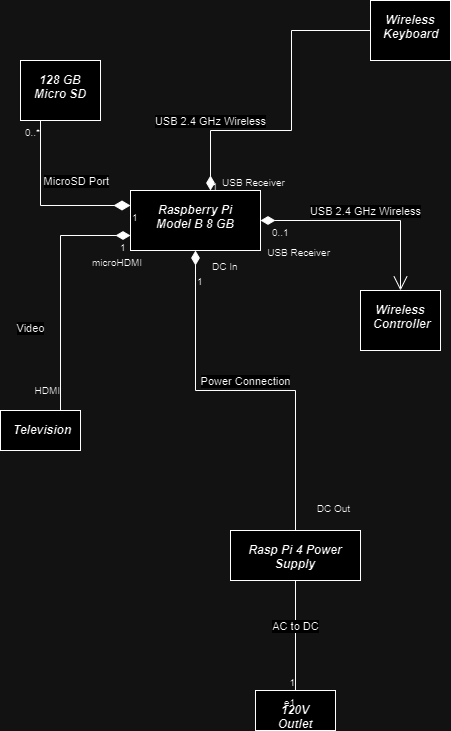
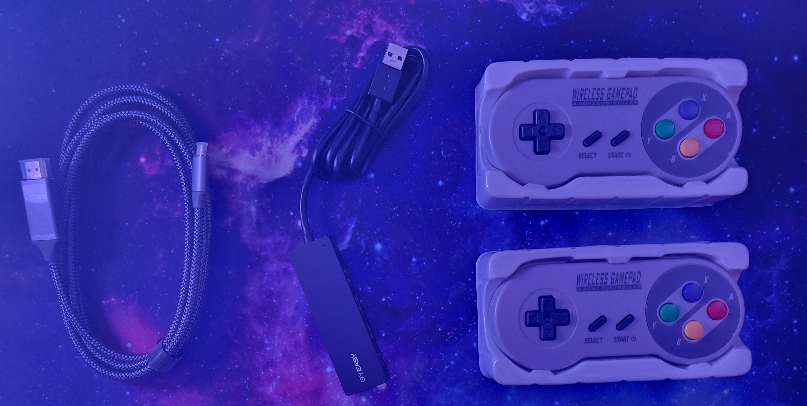
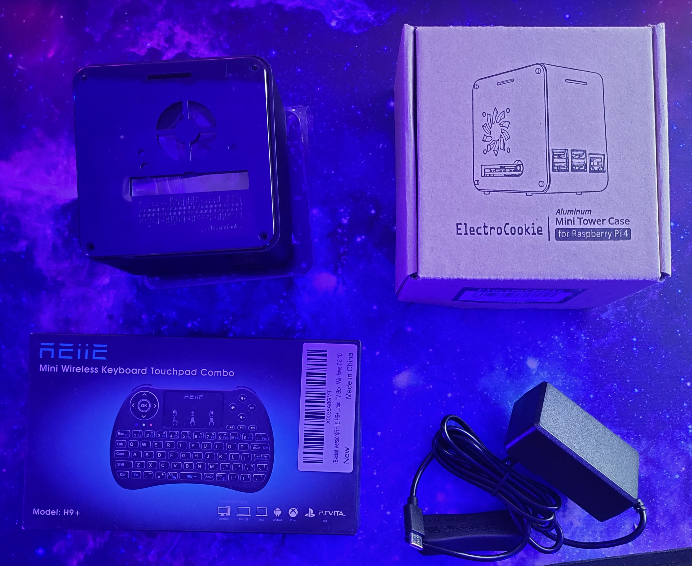

# retro-pi-console
Design documentation and project artifacts for a raspberry pi console emulator for retro video games. 

##Results

Here's a link to a [YouTube Video of Cave Story](https://youtu.be/Z5ow7Hn4VNo) starting up. 

## System Model (SysML Diagram)



## Abstract

It has always been a goal of mine to build the classic Raspberry Pi console emulator. It's a fun exercise in using the popular linux hardware platform. My roommate really wants a retro console so the situation alligned just right for me to be able to build it. 

In this README I will detail how I planned and executed the project. 

## Parts






### Raspberry Pi detailed model

## Timeline

### Research Phase

I was able to find plenty of web pages detailing how to make such a RaspPi console. 

My first Google search led me to this [PCWorld Article](https://www.pcworld.com/article/406449/how-to-build-a-raspberry-pi-retrogaming-emulation-console.html) which detailed the hardware I needed. In general, the parts list is pretty obvious. I have included a .CSV file on my parts list in this directory. 

```
retro-pi-console/Retro-Pi-Parts.csv
```

After doing some further reading I found that there are several competing platforms. The one that the PCWorld Article uses is called RetroPie. But there is also another project called RecalBox. 


Below, I've added a table comparing these two software platforms and what they offer. 


|     Feature     |       RetroPie       |       RecalBox    |
| --------------- | -------------------- | ----------------- |
| Number of Consoles | 
