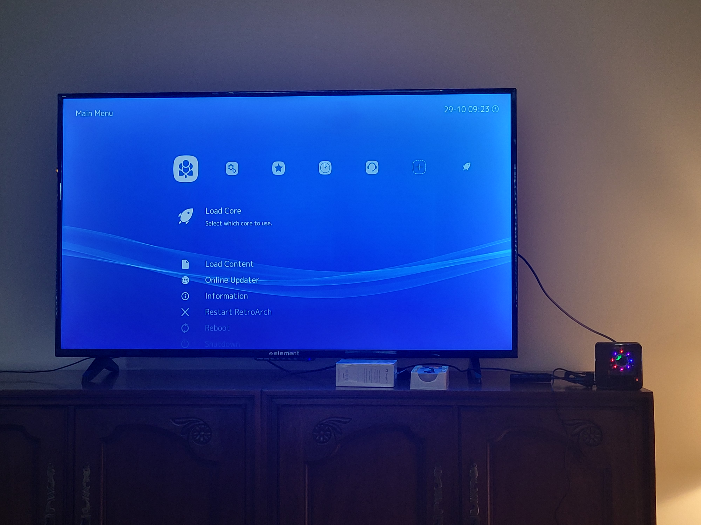
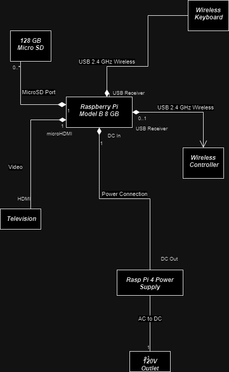
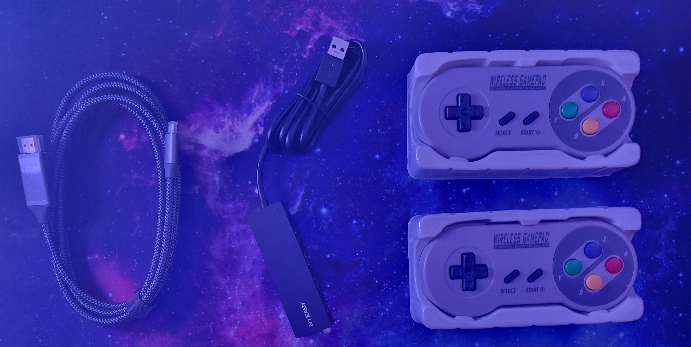
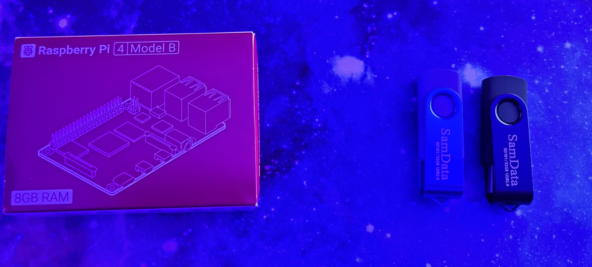
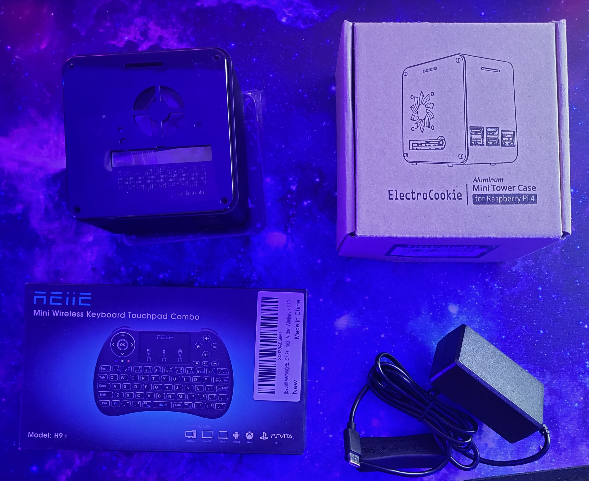
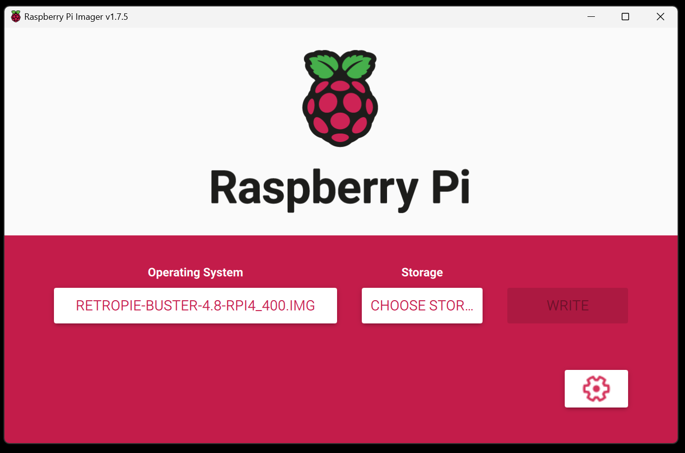
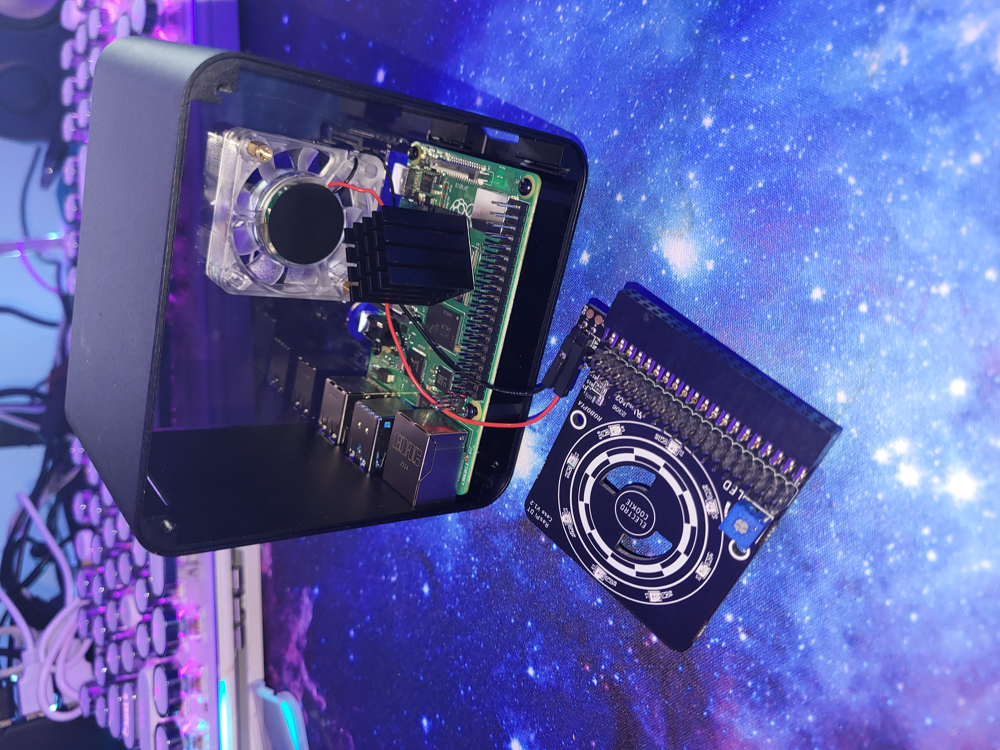

Check out my full [portfolio](https://www.markmusil.com/engineering).

# retro-pi-console

Design documentation and project artifacts for a raspberry pi console emulator for retro video games. 

## Results

Here's the Lakka interface running on the living room TV. 



Here's a link to a [YouTube Video of Cave Story](https://youtu.be/Z5ow7Hn4VNo) starting up. 


## System Model (SysML Diagram)



## Discussion


It has always been a goal of mine to build the classic Raspberry Pi console emulator. It's a fun exercise in using the popular Linux hardware platform. My roommate really wants a retro console so the situation aligned just right for me to be able to build it. I was able to find plenty of web pages detailing how to make such a RaspPi console. My first Google search led me to this [PCWorld Article](https://www.pcworld.com/article/406449/how-to-build-a-raspberry-pi-retrogaming-emulation-console.html) which detailed the hardware I needed. In general, the parts list is pretty obvious. I have included a .CSV file on my parts list in this directory. 

```
retro-pi-console/Retro-Pi-Parts.csv
```

After doing some further reading I found that there are several competing platforms. The one that the PCWorld Article uses is called RetroPi. But there is also another project called RecalBox. However when the parts arrived and I tried to run standard RetroPi it couldn't handle it so I found a Lakka which is a [lightweight version of RetroPi](https://www.lakka.tv/get/windows/rpi/). And this one ran well. 

## Parts








## Assembly

Get the [RaspPi Imager software here](https://www.raspberrypi.com/software/). 







